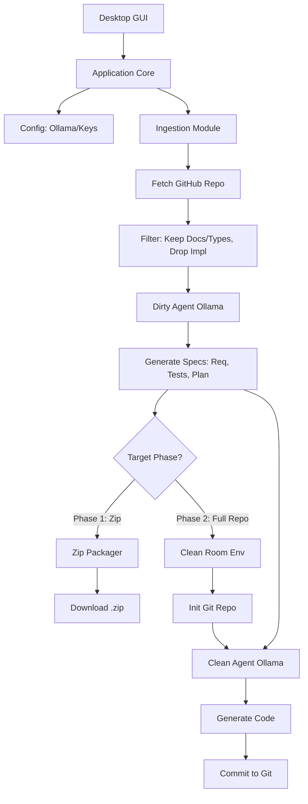

# Spite: Clean-Room AI Development Application Requirements

## 1. Overview
Spite is a local, AI-powered "Clean Room" development tool designed to safely re-implement open-source projects or dependencies without incurring original license obligations. Spite uses local AI models (e.g., via Ollama) to analyze the public interfaces of a target project and independently recreate a functionally equivalent, legally distinct version.

## 2. Core Principles
1.  **Isolation (The Clean Room):** The AI agent that analyzes the target repository (the "Dirty" agent) must never communicate implementation details or source code to the AI agent that implements the new code (the "Clean" agent). A restricted Q&A channel is permitted during implementation, strictly limited to clarifying observable, public behavior.
2.  **Specification-Driven:** The Dirty agent produces a strict, comprehensive set of requirements, tests, and an implementation plan based *only* on the target's public documentation, API specifications, and exported types. It must *not* read or copy the implementation details (source code).
3.  **Local Execution:** Prioritize privacy and security by defaulting to local LLMs (e.g., via Ollama), with the option to use user-provided AI service keys (OpenAI, Anthropic).

## 3. User Stories
### 3.1 Scenario: Analysis & Manual Implementation (Phase 1)
As a developer, I want to provide Spite with a GitHub repository URL so that it analyzes the project's public interfaces and generates a downloadable `.zip` file. This zip file should contain comprehensive requirements, agent instructions, test plans, and an implementation plan. I will then use my own AI coding tool (like GitHub Copilot or Claude Code) in a fresh workspace to implement the software according to the provided specifications, guaranteeing a clean-room break.

### 3.2 Scenario: Full AI Autonomous Recreation (Phase 2)
As a developer, I want to provide Spite with a GitHub repository URL and instruct it to fully recreate the project locally. Spite will internally manage the clean-room process:
1.  The "Dirty" agent analyzes the target and generates the specification (Phase 1).
2.  The specification is passed to a fresh, isolated "Clean" agent session.
3.  The Clean agent autonomously writes the new codebase, initializes a local Git repository, and commits the result.
The system should support a workflow where I can perform Phase 1 first, review the results, and then decide to proceed to Phase 2.

### 3.3 Scenario: AI Autonomous Recreation & Enhancement (Phase 3)
As a developer, I want Spite to not only recreate the project but also aggressively enhance it based on public feedback. After performing the full clean-room recreation (Phase 2), Spite will take the generated `IMPROVEMENTS.md` and use the "Clean" agent to iteratively apply these changes to the codebase, even if they alter the original API or functionality, committing the final, improved software to the repository.
The system should support a workflow where I can review the output of Phase 1 and/or Phase 2 before deciding to proceed to Phase 3.

## 4. Functional Requirements
### 4.1 Target Ingestion & Analysis
-   **Input:** Accept a target identifier (initially a GitHub repository URL), optionally a list of supplemental URLs (e.g., public documentation, discussion forums), and a checkbox to enable automated web search (enabled by default).
-   **Extraction:** Fetch the target repository's files and fetch content from the supplemental URLs and web search (if enabled) to gather public documentation and discussion forum context. The automated web search should explicitly seek documentation from locations like GitHub Pages and Read the Docs.
-   **Filtering:** The system must strictly filter the files sent to the "Dirty" analysis agent. It should only process:
    -   `README.md` and other documentation files.
    -   Type definition files (e.g., `.d.ts` in TypeScript, `__init__.py` or stubs in Python).
    -   Exported function/class signatures (parsing ASTs if necessary, but omitting implementation bodies).
    -   Content fetched from supplemental URLs or web searches.
-   **Output Generation:** The Dirty agent must generate:
    -   `REQUIREMENTS.md`: Detailed functional requirements based on the public API.
    -   `TESTING.md`: A comprehensive test plan to verify functional equivalence.
    -   `IMPLEMENTATION_PLAN.md`: A step-by-step guide for rebuilding the project from scratch.
    -   `AGENT_INSTRUCTIONS.md`: Specific prompts and constraints for the implementing AI agent.
    -   `IMPROVEMENTS.md`: Opportunities for improvement based on usage and features from public documentation and discussion forums (e.g., behavioral changes).
    -   `DIRTY_BIBLIOGRAPHY.md`: A bibliography of sources considered by the Dirty agent (links and commentary).
    -   `SYSTEM_OVERVIEW.md`: Original, non-quoted descriptions of the target system (in one sentence, one paragraph, and one page lengths) along with a proposed name for the replacement system.
    -   `SOURCE_EXCLUDES.txt`: A list of known original sources, repository names, and URLs associated with the target project.

### 4.2 Delivery Mechanisms
#### Phase 1: Zip Archive
-   Package the generated markdown files (`REQUIREMENTS.md`, `TESTING.md`, `IMPLEMENTATION_PLAN.md`, `AGENT_INSTRUCTIONS.md`, `IMPROVEMENTS.md`, `DIRTY_BIBLIOGRAPHY.md`, `SYSTEM_OVERVIEW.md`, `SOURCE_EXCLUDES.txt`) into a structured `.zip` archive.
-   Provide the zip file for saving via a desktop file dialog.

#### Phase 2: Local Git Working Directory
-   Initialize a new, empty Git repository in a local temporary directory.
-   Instantiate a new "Clean" AI agent session (e.g., via Ollama) with no prior context of the target repository.
-   Configure the Clean agent with an explicit blocklist using `SOURCE_EXCLUDES.txt` to guarantee it cannot query, browse, or reference the original source code or repository.
-   Feed the Clean agent the specifications generated in 4.1.
-   Execute an agentic loop (plan -> write code -> run tests -> iterate) until the implementation satisfies the `TESTING.md` plan.
-   During this loop, permit a restricted Q&A channel where the Clean agent can query the Dirty agent to clarify observable, public behavior. These interactions must be logged.
-   The Clean agent must explicitly state it has not used original sources and generate a `CLEAN_BIBLIOGRAPHY.md` detailing the valid sources it considered during implementation.
-   Commit the final codebase (including `CLEAN_BIBLIOGRAPHY.md` and a `CLEAN_DIRTY_QA_LOG.md` detailing the Q&A interactions) to the local Git repository and present the directory path to the user.
-   Provide a UI affordance to continue to Phase 3.

#### Phase 3: Enhanced Local Git Working Directory
-   Requires the completion of Phase 2 to establish a baseline clean-room implementation.
-   Feed the Clean agent the `IMPROVEMENTS.md` document.
-   Execute a secondary agentic loop to apply the improvements, allowing for breaking changes to the original API or functionality if necessary to address user feedback. The Clean agent must update the `CLEAN_BIBLIOGRAPHY.md` to reflect new sources or reasoning.
-   Commit the enhanced codebase as subsequent commits in the local Git repository and present the directory path to the user.

### 4.3 AI Integration
-   **Ollama (Primary):** Integrate with a locally running Ollama instance via its REST API. Allow the user to specify the model name (e.g., `llama3`, `qwen2.5-coder`).
-   **Cloud Providers (Secondary):** Support user-provided API keys for OpenAI (GPT-4o) and Anthropic (Claude 3.5 Sonnet) as fallback or premium options.

### 4.4 Desktop Interface (Python GUI)
-   **Core App:** The main logic loop running independent of the UI thread.
-   **GUI Frontend:** A clean, professional UI built with a Python GUI framework (e.g., PyQt6, PySide6, or CustomTkinter).
-   **Features:**
    -   Form to input the Target URL (GitHub).
    -   Input field for a list of supplemental URLs (public documentation, discussion forums) and a checkbox to enable automated web search (enabled by default).
    -   Configuration section for AI Provider (Ollama model selection or API key input).
    -   Selector (radio buttons or dropdown) for Target Phase (Phase 1: Zip, Phase 2: Full Git Repo, or Phase 3: Enhanced Git Repo), with UI support to progressively move between phases.
    -   Real-time progress indicators (using GUI progress bars and background thread signals) detailing the current step: \"Fetching Repo\", \"Analyzing Public API\", \"Generating Specs\", \"Zipping...\", \"Implementing Code...\", or \"Applying Improvements...\".

## 5. Ecosystem Expansion Roadmap
While the MVP focuses on GitHub repository URLs, the architecture must support future expansion:
-   **Stage 1 (MVP):** GitHub repositories.
-   **Stage 2:** Package managers. The user inputs a package name (e.g., `npm:lodash`, `pypi:requests`). Spite fetches the package tarball, extracts the documentation and public signatures, and runs the clean-room process.
-   **Stage 3:** Cargo (Rust), Go Modules, Maven (Java).

## 6. Non-Functional Requirements
-   **Performance:** The extraction and analysis phase may take hours to complete, depending on the target size, local LLM speed, and extent of web search/documentation analysis required.
-   **Reliability:** The system must handle rate limits gracefully (especially when fetching from GitHub).
-   **Security:** Never execute arbitrary code fetched from the target repository. The "Dirty" room must only perform static analysis.

## 7. Architecture Overview

