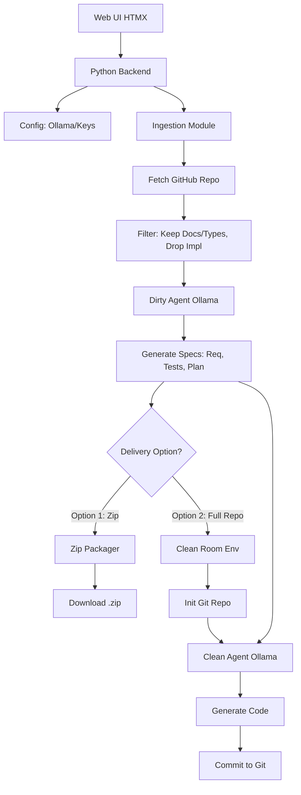

# Spite: Clean-Room AI Development Application Requirements

## 1. Overview
Spite is a local, AI-powered "Clean Room" development tool designed to safely re-implement open-source projects or dependencies without incurring original license obligations. Spite uses local AI models (e.g., via Ollama) to analyze the public interfaces of a target project and independently recreate a functionally equivalent, legally distinct version.

## 2. Core Principles
1.  **Isolation (The Clean Room):** The AI agent that analyzes the target repository (the "Dirty" agent) must never communicate its findings directly to the AI agent that implements the new code (the "Clean" agent).
2.  **Specification-Driven:** The Dirty agent produces a strict, comprehensive set of requirements, tests, and an implementation plan based *only* on the target's public documentation, API specifications, and exported types. It must *not* read or copy the implementation details (source code).
3.  **Local Execution:** Prioritize privacy and security by defaulting to local LLMs (e.g., via Ollama), with the option to use user-provided AI service keys (OpenAI, Anthropic).

## 3. User Stories
### 3.1 Scenario: Analysis & Manual Implementation (Delivery Option 1)
As a developer, I want to provide Spite with a GitHub repository URL so that it analyzes the project's public interfaces and generates a downloadable `.zip` file. This zip file should contain comprehensive requirements, agent instructions, test plans, and an implementation plan. I will then use my own AI coding tool (like GitHub Copilot or Claude Code) in a fresh workspace to implement the software according to the provided specifications, guaranteeing a clean-room break.

### 3.2 Scenario: Full AI Autonomous Recreation (Delivery Option 2)
As a developer, I want to provide Spite with a GitHub repository URL and instruct it to fully recreate the project locally. Spite will internally manage the clean-room process:
1.  The "Dirty" agent analyzes the target and generates the specification.
2.  The specification is passed to a fresh, isolated "Clean" agent session.
3.  The Clean agent autonomously writes the new codebase, initializes a local Git repository, and commits the result.

## 4. Functional Requirements
### 4.1 Target Ingestion & Analysis
-   **Input:** Accept a target identifier (initially a GitHub repository URL), optionally a list of supplemental URLs (e.g., public documentation, discussion forums), and a checkbox to enable automated web search (enabled by default).
-   **Extraction:** Fetch the target repository's files and fetch content from the supplemental URLs and web search (if enabled) to gather public documentation and discussion forum context.
-   **Filtering:** The system must strictly filter the files sent to the "Dirty" analysis agent. It should only process:
    -   `README.md` and other documentation files.
    -   Type definition files (e.g., `.d.ts` in TypeScript, `__init__.py` or stubs in Python).
    -   Exported function/class signatures (parsing ASTs if necessary, but omitting implementation bodies).
    -   Content fetched from supplemental URLs or web searches.
-   **Output Generation:** The Dirty agent must generate:
    -   `REQUIREMENTS.md`: Detailed functional requirements based on the public API.
    -   `TESTING.md`: A comprehensive test plan to verify functional equivalence.
    -   `IMPLEMENTATION_PLAN.md`: A step-by-step guide for rebuilding the project from scratch.
    -   `AGENT_INSTRUCTIONS.md`: Specific prompts and constraints for the implementing AI agent.
    -   `IMPROVEMENTS.md`: Opportunities for improvement based on usage and features from public documentation and discussion forums (e.g., behavioral changes).

### 4.2 Delivery Mechanisms
#### Delivery Option 1: Zip Archive
-   Package the generated markdown files (`REQUIREMENTS.md`, `TESTING.md`, `IMPLEMENTATION_PLAN.md`, `AGENT_INSTRUCTIONS.md`, `IMPROVEMENTS.md`) into a structured `.zip` archive.
-   Provide the zip file for download via the web interface.

#### Delivery Option 2: Local Git Working Directory
-   Initialize a new, empty Git repository in a local temporary directory.
-   Instantiate a new "Clean" AI agent session (e.g., via Ollama) with no prior context of the target repository.
-   Feed the Clean agent the specifications generated in 4.1.
-   Execute an agentic loop (plan -> write code -> run tests -> iterate) until the implementation satisfies the `TESTING.md` plan.
-   Commit the final codebase to the local Git repository and present the directory path to the user.

### 4.3 AI Integration
-   **Ollama (Primary):** Integrate with a locally running Ollama instance via its REST API. Allow the user to specify the model name (e.g., `llama3`, `qwen2.5-coder`).
-   **Cloud Providers (Secondary):** Support user-provided API keys for OpenAI (GPT-4o) and Anthropic (Claude 3.5 Sonnet) as fallback or premium options.

### 4.4 Web Interface (HTMX + Python Backend)
-   **Backend:** A lightweight Python web framework (e.g., FastAPI or Flask).
-   **Frontend:** A clean, professional, fast UI built with HTMX and Tailwind CSS (or similar minimal CSS framework).
-   **Features:**
    -   Form to input the Target URL (GitHub).
    -   Input field for a list of supplemental URLs (public documentation, discussion forums) and a checkbox to enable automated web search (enabled by default).
    -   Configuration section for AI Provider (Ollama model selection or API key input).
    -   Toggle switch to select Delivery Option 1 (Zip) or Option 2 (Full Git Repo).
    -   Real-time progress indicators (using HTMX SSE or WebSockets) detailing the current phase: "Fetching Repo", "Analyzing Public API", "Generating Specs", "Zipping...", or "Implementing Code...".

## 5. Ecosystem Expansion Roadmap
While the MVP focuses on GitHub repository URLs, the architecture must support future expansion:
-   **Phase 1 (MVP):** GitHub repositories.
-   **Phase 2:** Package managers. The user inputs a package name (e.g., `npm:lodash`, `pypi:requests`). Spite fetches the package tarball, extracts the documentation and public signatures, and runs the clean-room process.
-   **Phase 3:** Cargo (Rust), Go Modules, Maven (Java).

## 6. Non-Functional Requirements
-   **Performance:** The extraction and analysis phase should complete within minutes, depending on the target size and local LLM speed.
-   **Reliability:** The system must handle rate limits gracefully (especially when fetching from GitHub).
-   **Security:** Never execute arbitrary code fetched from the target repository. The "Dirty" room must only perform static analysis.

## 7. Architecture Overview

